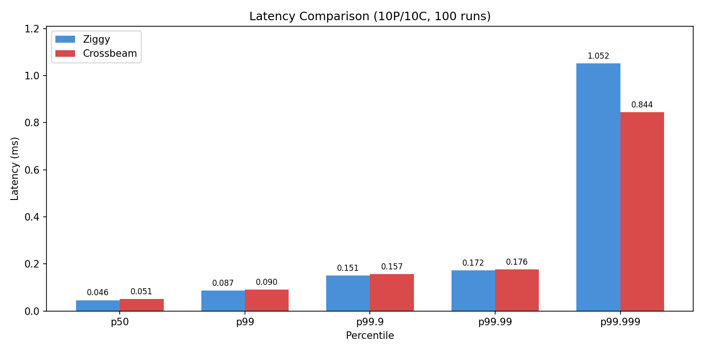
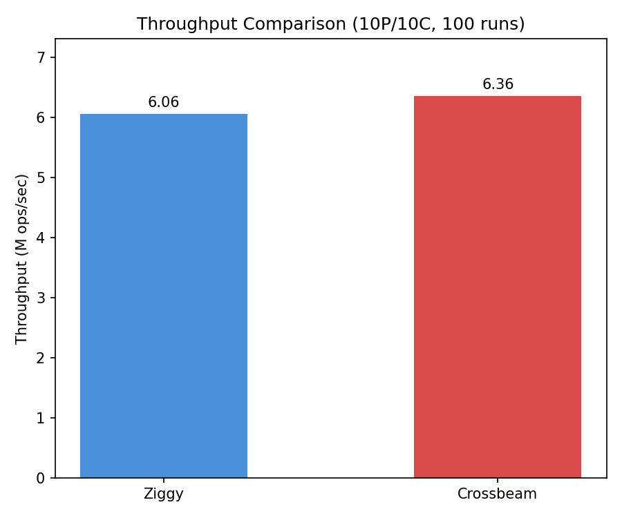

# ziggy

MPMC ring buffer in Zig. Lock-free, sequence-per-slot design.

## usage

```zig
const RingBuffer = @import("ziggy").RingBuffer;

var ring = try RingBuffer(u64).init(allocator, 512);
defer ring.deinit();

// producer
ring.produce(42);

// consumer
if (ring.tryConsume()) |val| { ... }
// or blocking:
if (ring.consume()) |val| { ... }

ring.close();
```

## build

```
zig build -Doptimize=ReleaseFast   # build
zig build test                      # run tests
zig build run -Doptimize=ReleaseFast  # run benchmarks
```

## benchmarks

10P/10C on 20-core machine, 100 runs each:

| metric     | ziggy     | crossbeam | diff |
|------------|-----------|-----------|------|
| throughput | 6.06 M/s  | 6.36 M/s  | -5%  |
| p50        | 0.046 ms  | 0.051 ms  | -9%  |
| p99        | 0.087 ms  | 0.090 ms  | -3%  |
| p99.9      | 0.151 ms  | 0.157 ms  | -4%  |
| p99.99     | 0.172 ms  | 0.176 ms  | -2%  |
| p99.999    | 1.052 ms  | 0.844 ms  | +25% |





ziggy wins on latency (p50-p99.99), crossbeam wins on throughput and extreme tail (p99.999).

173 lines of zig vs 639 lines of rust (array.rs only, full crossbeam-channel is 8600+ lines).

to run crossbeam benchmark:
```
cd benchmarks/crossbeam
cargo run --release
```
